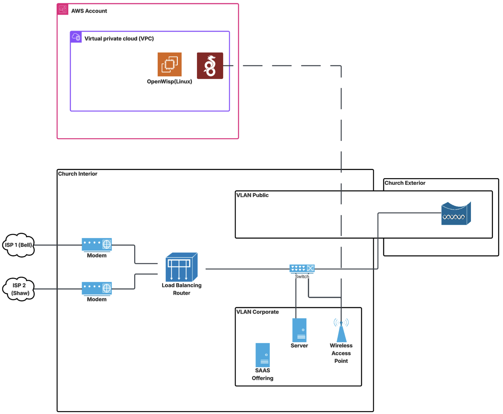

## Network Architecture Overview

This project illustrates a hybrid network infrastructure that integrates an on-premise church network with cloud services hosted on AWS, using VPN tunneling and VLAN segmentation for security, reliability, and remote manageability.

---

### AWS Cloud Integration

- **AWS VPC**: A Virtual Private Cloud hosts the remote infrastructure.
- **OpenWISP (Linux)**: A network management system deployed on AWS for managing VPN tunnels, monitoring, and policy control.
- **WireGuard VPN**: A fast, modern VPN protocol providing secure communication between the church and AWS.

Purpose: Enables remote access, centralized management, and secure communication with on-premises systems.

---

### Church Interior Network

- **Dual ISP Setup**:
  - ISP 1 (Bell) and ISP 2 (Shaw) provide redundancy.
  - Both ISPs connect to separate modems feeding into a load balancing router.

- **Load Balancing Router**:
  - Distributes internet traffic across both ISPs.
  - Supports automatic failover.
  - Manages VLAN segmentation for traffic isolation.

---

### VLAN Configuration

- **VLAN Public**:
  - Used for public-facing devices and the church exterior (e.g., guest Wi-Fi, outdoor surveillance).
  
- **VLAN Corporate**:
  - Handles internal operations, including:
    - Server hosting internal applications.
    - SaaS offering for internal cloud or externally accessible services.
    - Wireless access point for secure staff Wi-Fi access.

- The switch supports VLAN segmentation and routes traffic between internal components.

---

### VPN Tunnel

- A WireGuard VPN tunnel connects the load balancing router at the church to the AWS-hosted VPC.
- Managed via OpenWISP for control and monitoring.

Purpose:
- Encrypts all traffic between the church and AWS.
- Enables secure remote access and monitoring.
- Supports backup and synchronization with cloud services.

---

### Key Highlights

- Hybrid cloud design combining on-prem and AWS-hosted infrastructure.
- ISP redundancy ensures internet uptime through dual providers.
- Network segmentation improves security by isolating traffic types.
- Centralized management simplifies operations using OpenWISP.
- End-to-end encryption secures communication over the internet.

---

This setup ensures a secure, resilient, and manageable network for organizations requiring both local performance and cloud scalability.

