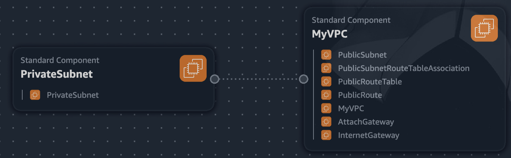
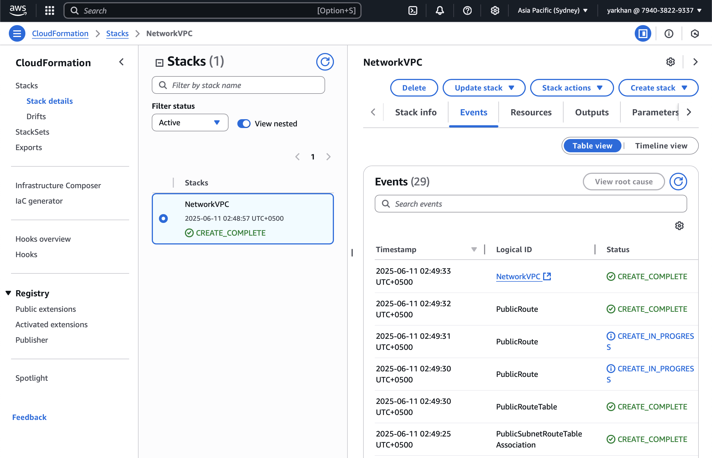
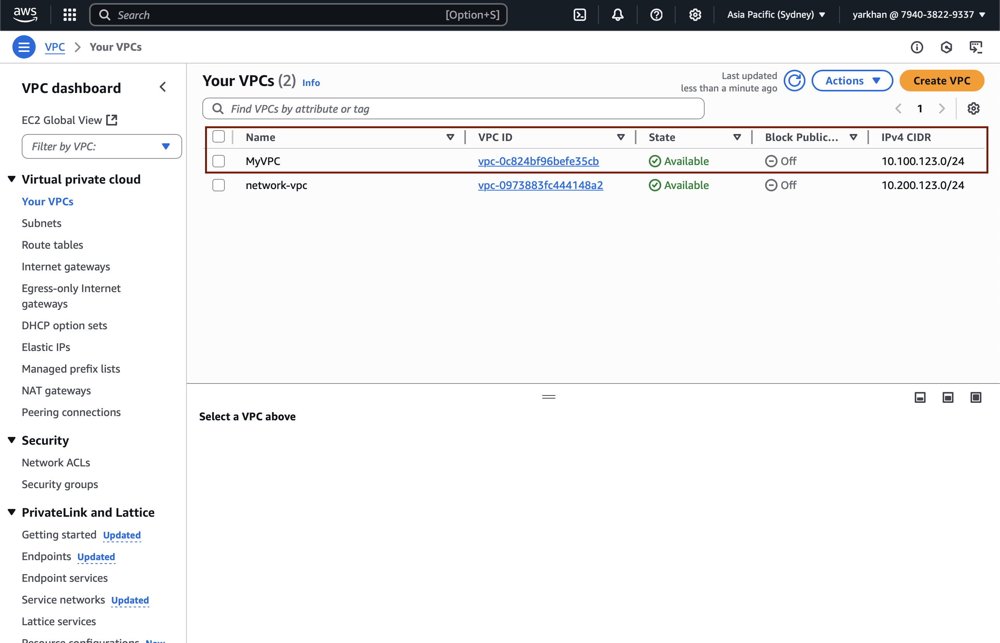

## VPC Settings

These are the VPC Settings for our cloud enviroment in AWS:

- VPC IPV4 CIDR Block: 10.100.123.0/24
- Ipv6 CIDR Block: No
- Number of AZs: 1
- Number of public subnets: 1 (10.100.123.0/28)
- Number of private subnets: 1 (10.100.123.128/28)
- NAT GATEWAYS: None
- VPC Endpoints: None
- DNS Options: Enable DNS Hostnames
- DNS options: Enable DNS Resolution

## Generate and Review CFN Template

Noted the VPC setting, provided this to LLM to produce the CFN template to automate the provision of the VPC infrastructure.

- Ask the LLM to refactor the parameters so that it would not be hard coded values and template is more reusable.

## Generated Deploy Script

Using ChatGPT generated a `bin/deploy`

## Visulization in Infrastructure Composer

Visualize our VPC via infrastructure composer but its not the best representation


## Installing AWS CLI

In order to deploy it via the AWS CLI, we need to install it.

```sh
curl "https://awscli.amazonaws.com/AWSCLIV2.pkg" -o "AWSCLIV2.pkg"
sudo installer -pkg AWSCLIV2.pkg -target /
```

## Configure AWS IAM Account
```sh
aws configure
```

## Deploy Resource To AWS

This is the resource map of VPC deployed via CFN


