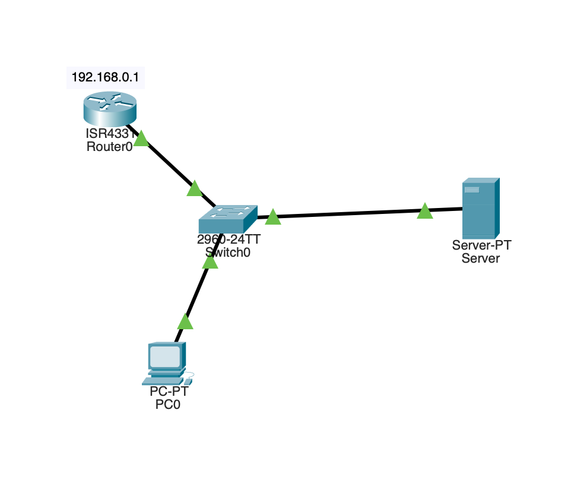

## State of the Network

While exploring Cisco Packet Tracer, I simulated a basic network designed to automatically assign IP addresses to devices (PCs) connected to it. The network consists of the following components:

- One Router with the IP address: 192.168.0.1
- One Switch that acts as the central connection point for all devices
- One Server with the IP address: 192.168.0.100, connected to the switch

The server is configured as a DHCP (Dynamic Host Configuration Protocol) server, which means it is responsible for automatically assigning IP addresses to any PC that is connected to the switch.

1. DHCP Process:
- When a PC is connected to the switch, it sends a DHCP Discover broadcast message.
- The server responds with a DHCP Offer, proposing an IP address.
- The PC then sends a DHCP Request to accept that offer.
- Finally, the server sends a DHCP Acknowledgement, and the PC is assigned an IP address.

2. Assigned IP Address:
- You can click on each PC → Desktop → IP Configuration to verify it receives an IP address from the 192.168.0.x range (e.g., 192.168.0.10).
- The default gateway will usually be set to the router's IP: 192.168.0.1.

3. Connectivity Test:

- You can use the ping command from a PC to:
    - Ping the router (192.168.0.1) to test gateway connectivity.
    - Ping the server (192.168.0.100) to ensure DHCP communication.
    - Ping another PC to test end-to-end connectivity.